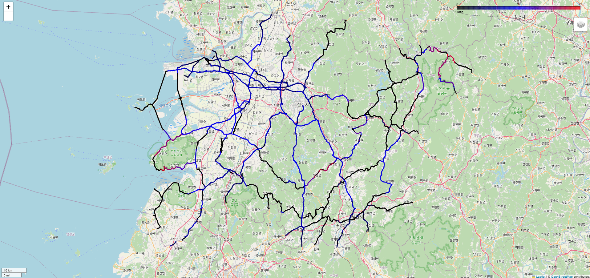

# JB DTG Processing

이 저장소는 DTG/교통망 데이터 처리, 집계, 지도 시각화 파이프라인을 제공하는 스크립트 모음입니다.

## 현재 폴더 구성
- `processingDTGJB.py`: 핵심 처리 유틸리티 모듈
- `processingDTGJB2.py`: `processingDTGJB`의 대체/개선 버전
- `untitled1.py`, `untitled2.py`: DTG 처리 실행용 스크립트
- `q3.py`, `q4.py`: 집계 및 후처리 실행 스크립트
- `plot5.py`, `plot6.py`: 지도 시각화 스크립트
- `JBROI.*`, `JBROI2.*`, `roi_box.gpkg`: ROI/지역 경계 데이터
- `bfg-1.15.0.jar`: Git 큰 파일 제거용 도구
- `scripts/`: 통합 실행 진입점

## 실행 경로 추천
- `python scripts/run_dtg_pipeline.py`
- `python scripts/run_dtg_pipeline_alt.py`
- `python scripts/run_q3.py`
- `python scripts/run_q4.py`
- `python scripts/plot_dtg_links.py`
- `python scripts/plot_dtg_links_alt.py`

## 기존 실행 경로
- `python untitled2.py`
- `python untitled1.py`
- `python q3.py`
- `python q4.py`
- `python plot5.py`
- `python plot6.py`

## 변경 사유 및 운영 방식
- 새 진입점으로 기존의 레거시 스크립트를 호출합니다.
- 기존 스크립트는 점진적으로 정리하면서 경로 관리와 실행 옵션을 통일해가고 있습니다.

## 설치 및 환경 설정
1. Python 패키지 설치
   ```bash
   pip install -r requirements.txt
   ```
2. 스크립트 내부의 하드코딩 경로(예: `/data1/...`)와 DB 연결 정보를 실제 환경에 맞게 수정하세요.
3. Git에는 대용량 데이터/바이너리를 포함하지 않으므로, 로컬 환경의 `data/`, `tools/` 경로가 유효한지 확인하세요.

## 정리 예정 항목
- 데이터/도구 파일을 `data/`, `tools/`로 분리해 보관하기
- `scripts/`에서 `argparse` 기반 공통 인터페이스 정비하기
- 환경별 경로를 `.env` 또는 별도 설정 파일로 분리하기

## 통합 CLI 실행
- `python scripts/cli.py pipeline`
- `python scripts/cli.py pipeline-alt`
- `python scripts/cli.py q3`
- `python scripts/cli.py q4`
- `python scripts/cli.py plot`
- `python scripts/cli.py plot-alt`

## 산출물 구성(현재 반영)
- 큰 바이너리/데이터 분리
  - `data/` : `JBROI*`, `roi_box.gpkg`
  - `tools/` : `bfg-1.15.0.jar`
- 데이터 경로 로더는 `project_paths.py`를 통해 `data/` 기준으로 해결됩니다.



## English Translation

This repository contains scripts for DTG/traffic network data processing, aggregation, and map visualization pipelines.

## Current Folder Structure
- `processingDTGJB.py`: Core processing utility module
- `processingDTGJB2.py`: Derived/alternative module of `processingDTGJB`
- `untitled1.py`, `untitled2.py`: DTG processing runner scripts
- `q3.py`, `q4.py`: Aggregation and post-processing runner scripts
- `plot5.py`, `plot6.py`: Map visualization scripts
- `JBROI.*`, `JBROI2.*`, `roi_box.gpkg`: Area/ROI data
- `bfg-1.15.0.jar`: Tool for cleaning Git history
- `scripts/`: Consolidated entry points

## Recommended Run Paths

Recommended entry points:
- `python scripts/run_dtg_pipeline.py`
- `python scripts/run_dtg_pipeline_alt.py`
- `python scripts/run_q3.py`
- `python scripts/run_q4.py`
- `python scripts/plot_dtg_links.py`
- `python scripts/plot_dtg_links_alt.py`

Legacy run paths:
- `python untitled2.py`
- `python untitled1.py`
- `python q3.py`
- `python q4.py`
- `python plot5.py`
- `python plot6.py`

The new entry points execute the existing legacy scripts directly. In later versions, you can gradually replace only the underlying target script files referenced by each entry point.

## Setup
1. Install Python dependencies
   ```bash
   pip install -r requirements.txt
   ```
2. Update hardcoded input paths in scripts (for example, `/data1/...`) and database connection settings to match your environment
3. Large data files are excluded from source control. Make sure paths are valid in your environment.

## Planned Cleanup
- Move data and tool files to `data/` and `tools/`
- Refactor shared logic into common utility modules, and standardize command options using `argparse` in `scripts/` entry points
- Externalize environment-specific paths into `.env` or a dedicated configuration file

## Consolidated Run Flow
- Prefer running core code through:
  - `python scripts/cli.py pipeline`
  - `python scripts/cli.py pipeline-alt`
  - `python scripts/cli.py q3`
  - `python scripts/cli.py q4`
  - `python scripts/cli.py plot`
  - `python scripts/cli.py plot-alt`

## Artifact Organization (Currently Applied)
- Large binaries and data are separated:
  - `data/`: `JBROI*`, `roi_box.gpkg`
  - `tools/`: `bfg-1.15.0.jar`
- Existing scripts were updated to use `project_paths.py`, which now resolves data files with `data/` prioritized automatically.
