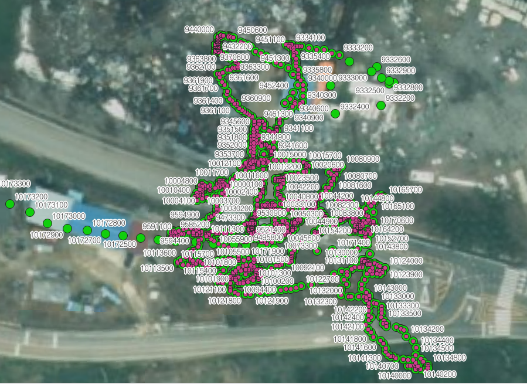
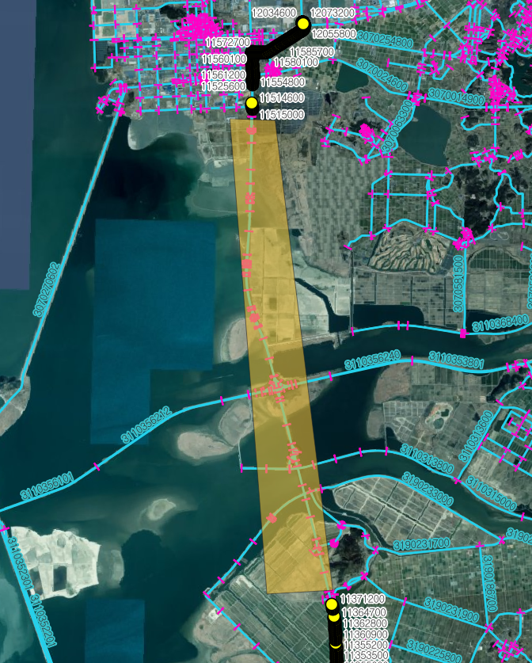

# A Study on the Effectiveness of Rest Areas Using Continuous Driving Time
# 연속 운전시간 기반 졸음쉼터 효과성 분석

이 저장소는 한국******공단 의뢰 하에 **화물차 연속 운전 데이터**를 이용해 졸음쉼터 배치의 효과를 정량적으로 분석한 연구 관련 맵매칭 코드입니다. 
This repository contains a data-processing and map-matching pipeline for evaluating rest-area effectiveness using truck continuous-driving records.

## 🎯 프로젝트 개요 / Project Overview
### 연구 배경 / Research Background
졸음쉼터의 배치와 이용성이 연속 운전시간 초과를 줄이는 데 미치는 효과를 DTG(기록계) 데이터를 기반으로 평가합니다.
This project evaluates whether rest-area infrastructure and placement can reduce long continuous driving time using truck DTG (digital tachograph) data.

### 분석 범위 / Study Scope
- 대상 도로망: 전라북도 일반국도 표준링크
- Analysis area: Road links of national highways in Jeollabuk-do.
- 기간: 2025-03-01 ~ 2025-08-31 (6개월)
- Period: 2025-03 to 2025-08 (6 months).
- 데이터: 차량ID, GPS(X/Y), 날짜·시간, 차량속성(V_TYPE) 등 DTG 필드
- Data source: Truck DTG records containing vehicle id, GPS coordinates, date/time, and vehicle metadata.

## 🔬 분석 절차 / Methodology
### 1) 데이터 수집 및 정제 / Data Ingestion and Cleaning
- `date`, `time`, `carid`, `V_TYPE`, `lon`, `lat`(또는 `GPSX`, `GPSY`)를 정규화합니다.
- Standardize raw fields into normalized columns: `date`, `time`, `carid`, `V_TYPE`, `lon`, `lat` (or `GPSX`, `GPSY`).

### 2) 연속 운전 구간 추출 / Continuous-Driving Extraction
- 차량별로 연속 운전 시간 구간을 추출하고, 여행(trip) 단위로 분할합니다.
- Extract continuous-driving segments per vehicle and segment them into trips.
- 동일 차량(carid) 기준으로 시간·거리 기준 EDA 및 trip 정합성을 점검합니다.
- Validate trip consistency by temporal sequence and distance consistency per vehicle.

### 3) 도로 링크 매칭 / Link Matching
- 각 trip의 샘플점들에서 도로 링크 매칭을 수행하고, 2.5시간 임계값 기준 구간을 분류합니다.
- Match trip points to road network links and classify segments by continuous-driving duration thresholds.
- 속도 조건(차량 기준 20~250 km/h 필터링 등)으로 오차를 정제합니다.
- Filter outliers with speed rules (e.g., valid speed range for trucks).
- !!To make it fast!!Refactored to a Class-based structure to encapsulate the Spatial Index (STRtree), reducing redundant index-building time and improving memory scope management.
  
### 4) 집계 및 시각화 / Aggregation and Visualization
- 긴 연속 운전(2h+, 2.5h+) 빈도, 링크 단위 교통량, VLM, 비율 등을 산출합니다.
- Compute long-duration metrics (>, 2h and >2.5h), link-level traffic, VLM, and ratio metrics.
- 전처리 결과와 임계치 결과를 지도 기반 plot으로 저장합니다.
- Save map/line visualizations as image outputs for inspection.

### 핵심 통계 / Key Statistics
- 전체 최대 차량통행량: 413,661대/링크 (평균 24,513대)
- Max vehicle count per link: 413,661 (average 24,513).
- 2시간 초과 구간: 최대 29,586대(링크 통행량의 59.7%), 평균 2,233대(11.5%)
- Continuous driving >2h: max 29,586 trucks (59.7% of link traffic), avg 2,233 trucks (11.5%).
- 2.5시간 초과 구간: 최대 11,691대(링크 통행량의 53.5%), 평균 1,100대(7.16%)
- Continuous driving >2.5h: max 11,691 trucks (53.5%), avg 1,100 trucks (7.16%).

## 🗺️ 분석 결과 예시 / Result Snapshots
아래 이미지는 데이터 구성, 샘플링 구간, 매칭·시각화 결과의 중간 점검 산출물입니다.
The figures below show intermediate data validation, sampled trajectory windows, and map matching outputs.






## 📁 디렉터리 구조 / Directory Structure
```text
MapmatchingTrajectorytoLinks/
├── processingDTGJB.py
├── processingDTGJB2.py
├── untitled1.py
├── untitled2.py
├── q3.py
├── q4.py
├── plot5.py
├── plot6.py
├── scripts/
│   ├── cli.py
│   ├── run_dtg_pipeline.py
│   ├── run_dtg_pipeline_alt.py
│   ├── run_q3.py
│   ├── run_q4.py
│   ├── plot_dtg_links.py
│   ├── plot_dtg_links_alt.py
├── JBROI.*
├── JBROI2.*
├── roi_box.gpkg
├── bfg-1.15.0.jar
├── data/
└── tools/
```

## 🧩 파일별 역할 / File Roles
### 처리 모듈 / Processing Modules
- `processingDTGJB.py` — 핵심 전처리 유틸리티 / Core processing utilities.
- `processingDTGJB2.py` — `processingDTGJB.py`의 보완/대체 모듈 / Companion/alternative variant.
- `untitled2.py` — DTG 파이프라인 기본 실행기 / Primary DTG pipeline entry.
- `untitled1.py` — DTG 파이프라인 보조/변형 실행기 / Secondary/alternate DTG pipeline entry.
- `q3.py` — 집계/정책 지표 산출기 / Aggregation and post-processing script.
- `q4.py` — 집계 확장 실험 스크립트 / Extended aggregation/analysis script.
- `plot5.py` — 지도 기반 시각화(1) / Map visualization routine #1.
- `plot6.py` — 지도 기반 시각화(2) / Map visualization routine #2.
- `JBROI*`, `JBROI2*`, `roi_box.gpkg` — 분석 영역(ROI) 정의 파일 / ROI geometry inputs.
- `bfg-1.15.0.jar` — Git 히스토리 정리/이력 정리 보조 도구 / Git history maintenance helper.

### `scripts/` 진입점 / Script Entry Points
- `scripts/cli.py` — 통합 실행 인터페이스 / Unified CLI dispatcher.
- `run_dtg_pipeline.py` — `untitled2.py` 래퍼 / Wrapper to `untitled2.py`.
- `run_dtg_pipeline_alt.py` — `untitled1.py` 래퍼 / Wrapper to `untitled1.py`.
- `run_q3.py` — `q3.py` 래퍼 / Wrapper to `q3.py`.
- `run_q4.py` — `q4.py` 래퍼 / Wrapper to `q4.py`.
- `plot_dtg_links.py` — `plot5.py` 래퍼 / Wrapper to `plot5.py`.
- `plot_dtg_links_alt.py` — `plot6.py` 래퍼 / Wrapper to `plot6.py`.

## ▶️ 실행 방법 / Run Instructions
### 권장 실행 방식 / Recommended
- `python scripts/cli.py pipeline`
- `python scripts/cli.py pipeline-alt`
- `python scripts/cli.py q3`
- `python scripts/cli.py q4`
- `python scripts/cli.py plot`
- `python scripts/cli.py plot-alt`

### 직접 실행 / Direct Mode
- `python untitled2.py`
- `python untitled1.py`
- `python q3.py`
- `python q4.py`
- `python plot5.py`
- `python plot6.py`

## ⚙️ 실행 환경 / Setup
1. `pip install -r requirements.txt`
2. 환경별 데이터 경로(`/data1/...` 등)와 DB 연결 설정을 실제 경로로 수정
3. 대용량 데이터 파일은 Git 추적에서 제외하고 실행 시 경로만 맞춤

## 📷 이미지 경로 점검 / Image Path Check
이미지 참조는 모두 상대 경로이며, 같은 폴더 내 파일이 존재하면 GitHub 렌더링 시 문제 없습니다.
All image references are relative; if the files exist in the repository root, they render correctly on GitHub.

## 📊 결과 표 (요약) / Summary Table
`final_merged_gdf2시간이상_방향추가251212.xlsx`의 `sheet1` 상위 결과를 `geometry`는 시작/종료 좌표만 축약해 표시합니다.
Shown below is a summary from `final_merged_gdf2시간이상_방향추가251212.xlsx` `sheet1`; geometry is shortened to start/end only.

| index | LINK_ID | geometry | vehicle_count | vehicle_count 기준 순위 | VLM | ratio | direction |
| --- | --- | --- | --- | --- | --- | --- | --- |
| 1484 | 3070020302 | LINESTRING (297841.96527919295 3980043.9288296015, 298782.834076233 3979939.0186604057) | 29551 | 1 | 242292 | 12.20%| 동 |
| 480 | 3070019300 | LINESTRING (294118.9405783998 3980121.988229847, 296611.921601332 3980047.724757389) | 29185 | 2 | 238253 | 12.25%| 동 |
| 1365 | 3110050400 | LINESTRING (310858.1111337207 3972940.4928400507, 311296.56675443635 3973201.4749663696) | 29110 | 3 | 268341 | 10.85%| 동 |
| 1939 | 3070020402 | LINESTRING (298787.34749683784 3979950.1366384136, 297842.3620516729 3980055.924890448) | 29096 | 4 | 274155 | 10.61%| 서 |
| 1028 | 3070008801 | LINESTRING (306191.9178838817 3977570.2769408426, 303503.7619772779 3979011.2397499904) | 28358 | 5 | 316221 | 8.97%| 서 |
| 2969 | 3070022800 | LINESTRING (297586.40745840943 3980116.226023371, 297225.1758749983 3980172.602097907) | 28303 | 6 | 265631 | 10.66%| 서 |
| 475 | 3070243400 | LINESTRING (296611.921601332 3980047.724757389, 296918.199608747 3980103.997398246) | 28266 | 7 | 226935 | 12.46%| 동 |
| 1562 | 3070022700 | LINESTRING (297226.72092121094 3980160.699836365, 297582.9809467876 3980104.722794104) | 28257 | 8 | 229146 | 12.33%| 동 |
| 364 | 3070020301 | LINESTRING (297582.9809467876 3980104.722794104, 297841.96527919295 3980043.9288296015) | 28254 | 9 | 228483 | 12.37%| 동 |
| 3173 | 3070014700 | LINESTRING (299237.5559036793 3979776.7882304047, 299438.2845675852 3979723.68819917) | 27702 | 10 | 223410 | 12.40%| 동 |

## 🧾 정리 항목 / Cleanup Status
- `project_paths.py`를 통해 `data/` 우선 탐색을 적용했습니다.
- `scripts/`와 루트 실행 스크립트의 역할을 분리해 유지보수성을 높였습니다.
- `argparse` 기반 옵션 정리를 통해 실행 명령의 일관성을 확보했습니다.
- Large-data assets should remain under `data/` or `tools/` and be excluded from Git history when possible.

## 🙏 Acknowledgement
This work was supported by the Korea Transportation Safety Authority (KOSAT) under the Ministry of Land, Infrastructure and Transport of the Republic of Korea.
